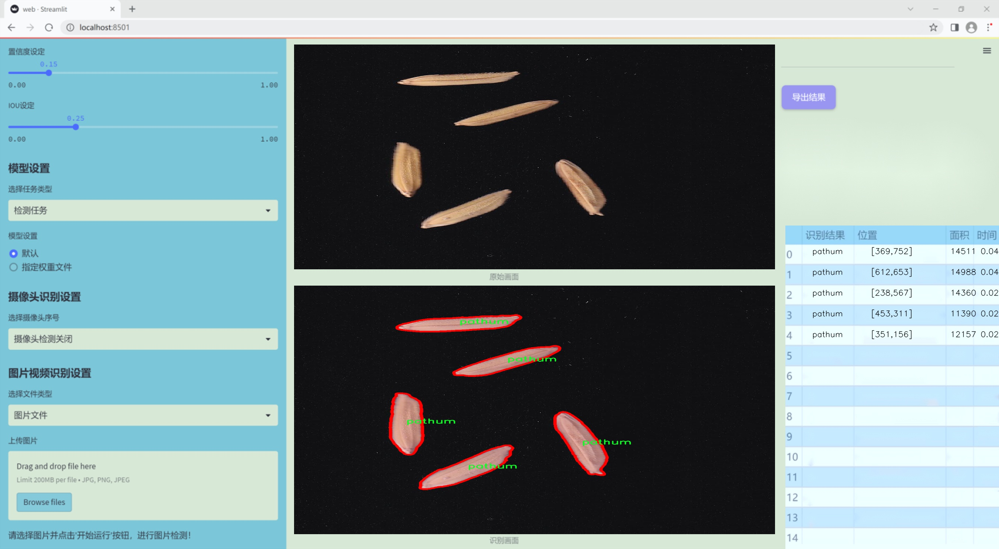
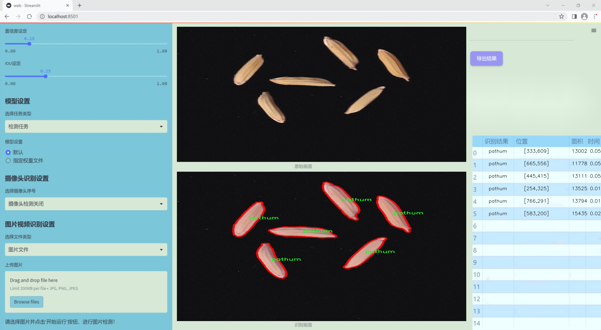
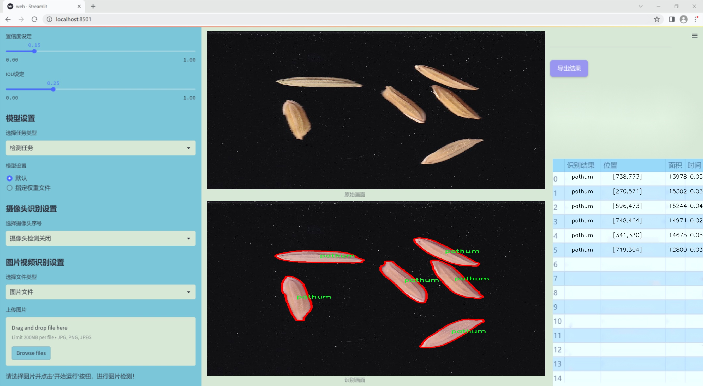
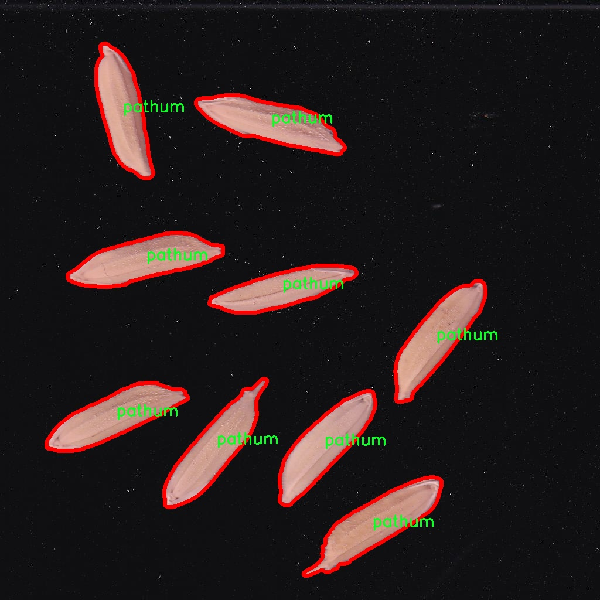
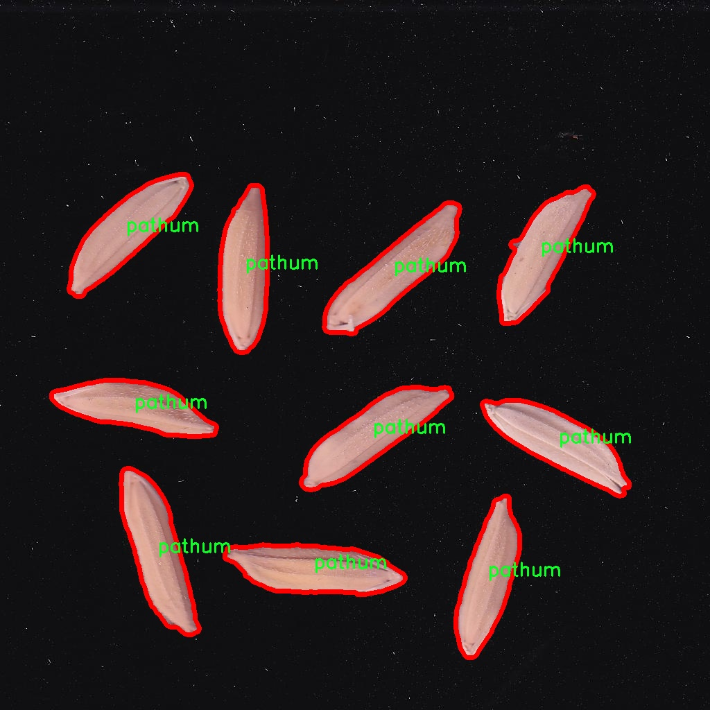
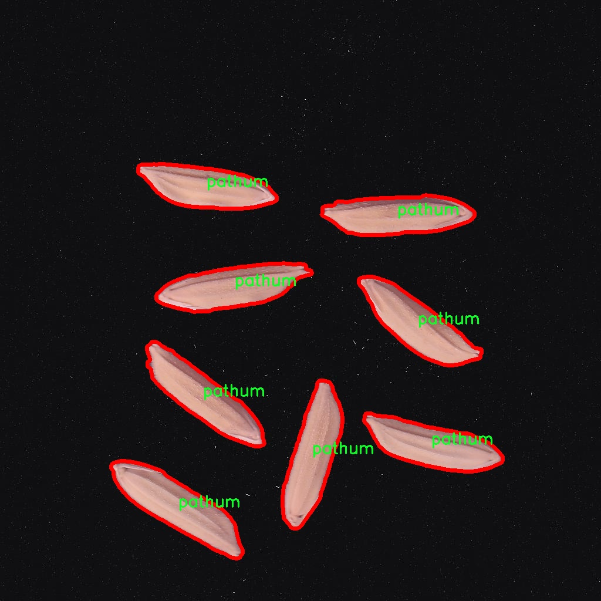
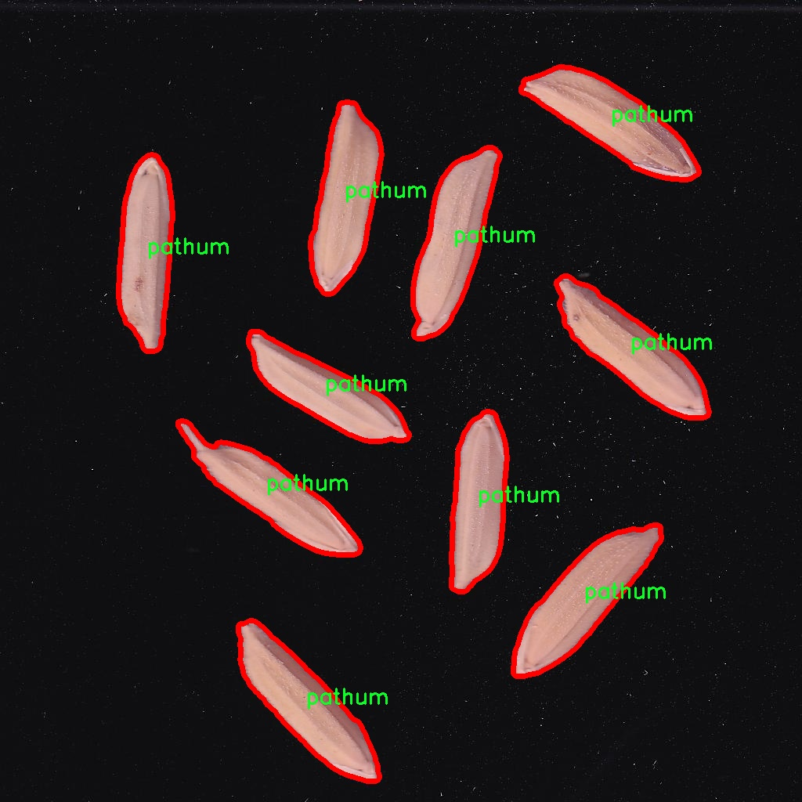
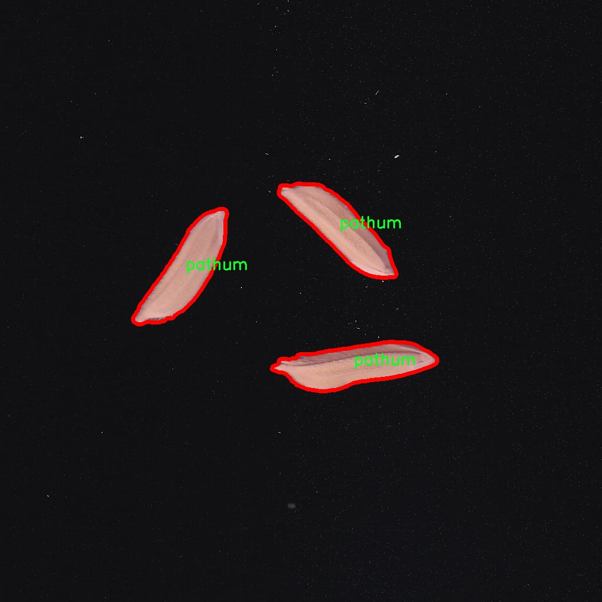

### 1.背景意义

研究背景与意义

水稻作为全球最重要的粮食作物之一，直接影响着数十亿人的生存与发展。随着全球人口的不断增长，水稻的生产和品种选择显得尤为重要。不同水稻品种在产量、抗病性、适应性等方面存在显著差异，因此，快速、准确地识别水稻品种对于农业生产、科研和市场营销具有重要意义。传统的水稻品种识别方法主要依赖于人工观察和专家鉴定，效率低下且容易受到主观因素的影响。近年来，计算机视觉技术的迅猛发展为水稻品种的自动识别提供了新的可能性。

本研究旨在基于改进的YOLOv11模型，构建一个高效的水稻品种识别系统。YOLO（You Only Look Once）系列模型以其快速和准确的特性在目标检测领域取得了显著成果。通过对YOLOv11进行改进，我们希望能够提高其在水稻品种识别中的性能，尤其是在复杂环境下的识别准确率。为此，我们使用了包含1700张图像的Paddy_Dataset数据集，该数据集涵盖了两种水稻品种：Pathum和Thaihommali。数据集的构建经过精心设计，确保了样本的多样性和代表性，为模型的训练提供了坚实的基础。

此外，随着深度学习技术的不断进步，数据集的质量和规模对模型性能的影响愈发显著。通过对数据集的深入分析和处理，我们将探索如何利用先进的图像处理技术和机器学习算法，提升水稻品种识别的准确性和效率。这不仅有助于推动农业智能化的发展，也为实现精准农业提供了技术支持。通过本研究，我们期望为水稻品种的快速识别提供一种新的解决方案，从而为农业生产的科学决策提供数据支持，最终促进粮食安全和可持续发展。

### 2.视频效果

[2.1 视频效果](https://www.bilibili.com/video/BV1rBrfYjEXv/)

### 3.图片效果







##### [项目涉及的源码数据来源链接](https://kdocs.cn/l/cszuIiCKVNis)**

注意：本项目提供训练的数据集和训练教程,由于版本持续更新,暂不提供权重文件（best.pt）,请按照6.训练教程进行训练后实现上图演示的效果。

### 4.数据集信息

##### 4.1 本项目数据集类别数＆类别名

nc: 2
names: ['pathum', 'thaihommali']


该项目为【图像分割】数据集，请在【训练教程和Web端加载模型教程（第三步）】这一步的时候按照【图像分割】部分的教程来训练

##### 4.2 本项目数据集信息介绍

本项目数据集信息介绍

本项目所使用的数据集名为“Paddy_Dataset”，旨在为改进YOLOv11的水稻品种识别系统提供支持。该数据集专注于水稻品种的分类，具体涵盖了两种主要的水稻品种：Pathum和Thai Hom Mali。这两种水稻品种在农业生产中具有重要的经济价值和文化意义，因此，准确的品种识别对于农业管理、产量预测以及市场营销等方面都具有重要的应用价值。

数据集中的样本数量经过精心挑选和标注，确保涵盖了这两种水稻品种在不同生长阶段、不同光照条件以及不同环境背景下的多样性。这种多样性不仅有助于提高模型的泛化能力，还能增强其在实际应用中的鲁棒性。数据集中包含的图像经过专业的标注，以确保每个样本都能清晰地反映出目标品种的特征，从而为YOLOv11的训练提供高质量的输入。

在数据预处理阶段，我们对图像进行了标准化处理，以确保输入数据的一致性。此外，数据集还进行了增强处理，包括旋转、缩放和亮度调整等，以进一步扩展样本的多样性。这些措施旨在提高模型在实际应用中的表现，使其能够在复杂的环境中准确识别水稻品种。

通过对“Paddy_Dataset”的深入分析和利用，我们期望能够提升YOLOv11在水稻品种识别任务中的性能，为农业智能化发展贡献一份力量。最终目标是实现高效、准确的水稻品种识别，助力农业生产的可持续发展。











### 5.全套项目环境部署视频教程（零基础手把手教学）

[5.1 所需软件PyCharm和Anaconda安装教程（第一步）](https://www.bilibili.com/video/BV1BoC1YCEKi/?spm_id_from=333.999.0.0&vd_source=bc9aec86d164b67a7004b996143742dc)


[5.2 安装Python虚拟环境创建和依赖库安装视频教程（第二步）](https://www.bilibili.com/video/BV1ZoC1YCEBw?spm_id_from=333.788.videopod.sections&vd_source=bc9aec86d164b67a7004b996143742dc)

### 6.改进YOLOv11训练教程和Web_UI前端加载模型教程（零基础手把手教学）

[6.1 改进YOLOv11训练教程和Web_UI前端加载模型教程（第三步）](https://www.bilibili.com/video/BV1BoC1YCEhR?spm_id_from=333.788.videopod.sections&vd_source=bc9aec86d164b67a7004b996143742dc)


按照上面的训练视频教程链接加载项目提供的数据集，运行train.py即可开始训练



     Epoch   gpu_mem       box       obj       cls    labels  img_size
     1/200     20.8G   0.01576   0.01955  0.007536        22      1280: 100%|██████████| 849/849 [14:42<00:00,  1.04s/it]
               Class     Images     Labels          P          R     mAP@.5 mAP@.5:.95: 100%|██████████| 213/213 [01:14<00:00,  2.87it/s]
                 all       3395      17314      0.994      0.957      0.0957      0.0843

     Epoch   gpu_mem       box       obj       cls    labels  img_size
     2/200     20.8G   0.01578   0.01923  0.007006        22      1280: 100%|██████████| 849/849 [14:44<00:00,  1.04s/it]
               Class     Images     Labels          P          R     mAP@.5 mAP@.5:.95: 100%|██████████| 213/213 [01:12<00:00,  2.95it/s]
                 all       3395      17314      0.996      0.956      0.0957      0.0845

     Epoch   gpu_mem       box       obj       cls    labels  img_size
     3/200     20.8G   0.01561    0.0191  0.006895        27      1280: 100%|██████████| 849/849 [10:56<00:00,  1.29it/s]
               Class     Images     Labels          P          R     mAP@.5 mAP@.5:.95: 100%|███████   | 187/213 [00:52<00:00,  4.04it/s]
                 all       3395      17314      0.996      0.957      0.0957      0.0845


###### [项目数据集下载链接](https://kdocs.cn/l/cszuIiCKVNis)

### 7.原始YOLOv11算法讲解


###### YOLOv11改进方向

与YOLOv 10相比，YOLOv 11有了巨大的改进，包括但不限于：

  * 增强的模型结构：模型具有改进的模型结构，以获取图像处理并形成预测
  * GPU优化：这是现代ML模型的反映，GPU训练ML模型在速度和准确性上都更好。
  * 速度：YOLOv 11模型现在经过增强和GPU优化以用于训练。通过优化，这些模型比它们的前版本快得多。在速度上达到了25%的延迟减少！
  * 更少的参数：更少的参数允许更快的模型，但v11的准确性不受影响
  * 更具适应性：更多支持的任务YOLOv 11支持多种类型的任务、多种类型的对象和多种类型的图像。

###### YOLOv11功能介绍

Glenn Jocher和他的团队制作了一个令人敬畏的YOLOv 11迭代，并且在图像人工智能的各个方面都提供了YOLO。YOLOv 11有多种型号，包括：

  * 对象检测-在训练时检测图像中的对象
  * 图像分割-超越对象检测，分割出图像中的对象
  * 姿态检测-当用点和线训练时绘制一个人的姿势
  * 定向检测（OBB）：类似于对象检测，但包围盒可以旋转
  * 图像分类-在训练时对图像进行分类

使用Ultralytics Library，这些模型还可以进行优化，以：

  * 跟踪-可以跟踪对象的路径
  * 易于导出-库可以以不同的格式和目的导出
  * 多场景-您可以针对不同的对象和图像训练模型

此外，Ultralytics还推出了YOLOv 11的企业模型，该模型将于10月31日发布。这将与开源的YOLOv
11模型并行，但将拥有更大的专有Ultralytics数据集。YOLOv 11是“建立在过去的成功”的其他版本的之上。

###### YOLOv11模型介绍

YOLOv 11附带了边界框模型（无后缀），实例分割（-seg），姿态估计（-pose），定向边界框（-obb）和分类（-cls）。

这些也有不同的尺寸：纳米（n），小（s），中（m），大（l），超大（x）。


YOLOv11模型

###### YOLOv11与前版本对比

与YOLOv10和YOLOv8相比，YOLOv11在Ultralytics的任何帖子中都没有直接提到。所以我会收集所有的数据来比较它们。感谢Ultralytics：

**检测：**


YOLOv11检测统计


YOLOv10检测统计

其中，Nano的mAPval在v11上为39.5，v10上为38.5；Small为47.0 vs 46.3，Medium为51.5 vs
51.1，Large为53.4 vs 53.2，Extra Large为54.7vs
54.4。现在，这可能看起来像是一种增量增加，但小小数的增加可能会对ML模型产生很大影响。总体而言，YOLOv11以0.3
mAPval的优势追平或击败YOLOv10。

现在，我们必须看看速度。在延迟方面，Nano在v11上为1.55 , v10上为1.84，Small为2.46 v2.49，Medium为4.70
v4.74，Large为6.16 v7.28，Extra Large为11.31
v10.70。延迟越低越好。YOLOv11提供了一个非常低的延迟相比，除了特大做得相当差的前身。

总的来说，Nano模型是令人振奋的，速度更快，性能相当。Extra Large在性能上有很好的提升，但它的延迟非常糟糕。

**分割：**


YOLOV11 分割统计


YOLOV9 分割统计


YOLOV8 分割数据

总体而言，YOLOv 11上的分割模型在大型和超大型模型方面比上一代YOLOv 8和YOLOv 9做得更好。

YOLOv 9 Segmentation没有提供任何关于延迟的统计数据。比较YOLOv 11延迟和YOLOv 8延迟，发现YOLOv 11比YOLOv
8快得多。YOLOv 11将大量GPU集成到他们的模型中，因此期望他们的模型甚至比CPU测试的基准更快！

姿态估计：


YOLOV11姿态估计统计


YOLOV8姿态估计统计

YOLOv 11的mAP 50 -95统计量也逐渐优于先前的YOLOv 8（除大型外）。然而，在速度方面，YOLOv
11姿势可以最大限度地减少延迟。其中一些延迟指标是版本的1/4！通过对这些模型进行GPU训练优化，我可以看到指标比显示的要好得多。

**定向边界框：**


YOLOv11 OBB统计


YOLOv8 OBB统计

OBB统计数据在mAP
50上并不是很好，只有非常小的改进，在某种程度上小于检测中的微小改进。然而，从v8到v11的速度减半，这表明YOLOv11在速度上做了很多努力。

**最后，分类：**


YOLOv 11 CLS统计


YOLOv8 CLS统计

从v8到v11，准确性也有了微小的提高。然而，速度大幅上升，CPU速度更快的型号。


### 8.200+种全套改进YOLOV11创新点原理讲解

#### 8.1 200+种全套改进YOLOV11创新点原理讲解大全

由于篇幅限制，每个创新点的具体原理讲解就不全部展开，具体见下列网址中的改进模块对应项目的技术原理博客网址【Blog】（创新点均为模块化搭建，原理适配YOLOv5~YOLOv11等各种版本）

[改进模块技术原理博客【Blog】网址链接](https://gitee.com/qunmasj/good)


#### 8.2 精选部分改进YOLOV11创新点原理讲解

###### 这里节选部分改进创新点展开原理讲解(完整的改进原理见上图和[改进模块技术原理博客链接](https://gitee.com/qunmasj/good)【如果此小节的图加载失败可以通过CSDN或者Github搜索该博客的标题访问原始博客，原始博客图片显示正常】

### 上下文引导网络（CGNet）简介


高准确率的模型（蓝点），由图像分类网络转化而来且参数量大，因此大多不适于移动设备。
低分辨率的小模型（红点），遵循分类网络的设计方式，忽略了分割特性，故而效果不好。
#### CGNet的设计：
为了提升准确率，用cgnet探索语义分割的固有属性。对于准确率的提升，因为语义分割是像素级分类和目标定位，所以空间依赖性和上下文信息发挥了重要作用。因此，设计cg模块，用于建模空间依赖性和语义上下文信息。
- 1、cg模块学习局部特征和周围特征形成联合特征
- 2、通过逐通道重新加权（强调有用信息，压缩无用信息），用全局特征改善联合特征
- 3、在全阶段应用cg模块，以便从语义层和空间层捕捉信息。
为了降低参数量：1、深层窄网络，尽可能节约内存 2、用通道卷积


之前的网络根据框架可分三类：
- 1、FCN-shape的模型，遵循分类网络的设计，忽略了上下文信息 ESPNet、ENet、fcn
- 2、FCN-CM模型，在编码阶段后用上下文模块捕捉语义级信息 DPC、DenseASPP、DFN、PSPNet
- 3、（our）在整个阶段捕捉上下文特征
- 4、主流分割网络的下采样为五次，学习了很多关于物体的抽象特征，丢失了很多有鉴别性的空间信息，导致分割边界过于平滑，（our）仅采用三次下采样，利于保存空间信息


#### cg模块

Cg模块：
思路：人类视觉系统依赖上下文信息理解场景。
如图3,a， 如若仅关注黄色框框，很难分辨，也就是说，仅关注局部特征不容易正确识别目标的类别。 然后，如果加入了目标周围的特征，即图3,b，就很容易识别正确，所以周围特征对于语义分割是很有帮助的。在此基础上，如果进一步用整个场景的特征加以辅助，将会有更高的程度去争正确分类黄色框框的物体，如图3,c所示。 故，周围上下文和全局上下文对于提升分割精度都是有帮助的。


实现：基于此，提出cg模块，利用局部特征，周围上下文以及全局上下文。如图3,d所示。该模块共包含两个阶段。

第一步，floc( ) 局部和 fsur( )周围函数分别学习对应特征。floc( )用3x3卷积从周围8个点提取特征，对应于黄色框框；同时fsur( )用感受野更大的3x3带孔卷积学习周围上下文，对应红色框框。然后fjoi( )是指将前两路特征concat之后经BN，PReLU。此一部分是cg模块的第一步。
对于模块的第二步，fglo( )用于提取全局特征，改善联合特征。受SENet启发，全局上下文被认为是一个加权向量，用于逐通道微调联合特征，以强调有用元素、压缩无用元素。在本论文中，fglo( )用GAP产生聚合上下文特征，然后用多层感知机进一步提取全局上下文。最后，使用一个尺度层对联合特征重新加权用提取的全局上下文。
残差连接有利于学习更复杂的特征以及便于训练时梯度反向传播。两个拟设计方案，LRL局部残差连接和GRL全局残差连接，实验证明（消融实验），GRL效果更好

#### CGNet网络


原则：深、瘦（deep and thin）以节省内存。层数少，通道数少，三个下采样。

Stage1，三个标准卷积层，分辨率变成原来的1/2

Stage2和stage3，分别堆叠M和N个cg模块。该两个阶段，第一层的输入是前一阶段第一个和最后一个block的结合（how结合）利于特征重用和特征传播。

将输入图像下采样到1/4和1/8分别输入到第2和3阶段。

最后，用1x1卷积层进行分割预测。

为进一步降低参数量，局部和周围特征提取器采用了逐通道卷积。之前有的工作在逐通道卷积后采用1x1卷积用以改善通道间的信息流动，本文消融实验显示效果不好，分析：因为cg模块中提取的局部和全局特征需要保持通道独立性，所以本论文不使用1*1卷积。


### 9.系统功能展示

图9.1.系统支持检测结果表格显示

  图9.2.系统支持置信度和IOU阈值手动调节

  图9.3.系统支持自定义加载权重文件best.pt(需要你通过步骤5中训练获得)

  图9.4.系统支持摄像头实时识别

  图9.5.系统支持图片识别

  图9.6.系统支持视频识别

  图9.7.系统支持识别结果文件自动保存

  图9.8.系统支持Excel导出检测结果数据


### 10. YOLOv11核心改进源码讲解

#### 10.1 RFAConv.py

以下是代码中最核心的部分，并附上详细的中文注释：

```python
import torch
import torch.nn as nn
from einops import rearrange

class h_sigmoid(nn.Module):
    def __init__(self, inplace=True):
        super(h_sigmoid, self).__init__()
        self.relu = nn.ReLU6(inplace=inplace)  # 使用ReLU6激活函数

    def forward(self, x):
        return self.relu(x + 3) / 6  # 计算h-sigmoid

class h_swish(nn.Module):
    def __init__(self, inplace=True):
        super(h_swish, self).__init__()
        self.sigmoid = h_sigmoid(inplace=inplace)  # 使用h-sigmoid作为sigmoid部分

    def forward(self, x):
        return x * self.sigmoid(x)  # 计算h-swish

class RFAConv(nn.Module):
    def __init__(self, in_channel, out_channel, kernel_size, stride=1):
        super().__init__()
        self.kernel_size = kernel_size

        # 生成权重的网络结构
        self.get_weight = nn.Sequential(
            nn.AvgPool2d(kernel_size=kernel_size, padding=kernel_size // 2, stride=stride),
            nn.Conv2d(in_channel, in_channel * (kernel_size ** 2), kernel_size=1, groups=in_channel, bias=False)
        )
        
        # 生成特征的网络结构
        self.generate_feature = nn.Sequential(
            nn.Conv2d(in_channel, in_channel * (kernel_size ** 2), kernel_size=kernel_size, padding=kernel_size // 2, stride=stride, groups=in_channel, bias=False),
            nn.BatchNorm2d(in_channel * (kernel_size ** 2)),
            nn.ReLU()
        )
        
        # 最终卷积层
        self.conv = nn.Conv2d(in_channel, out_channel, kernel_size=kernel_size, stride=kernel_size)

    def forward(self, x):
        b, c = x.shape[0:2]  # 获取批量大小和通道数
        weight = self.get_weight(x)  # 计算权重
        h, w = weight.shape[2:]  # 获取特征图的高和宽
        weighted = weight.view(b, c, self.kernel_size ** 2, h, w).softmax(2)  # 计算权重的softmax
        feature = self.generate_feature(x).view(b, c, self.kernel_size ** 2, h, w)  # 生成特征
        weighted_data = feature * weighted  # 加权特征
        conv_data = rearrange(weighted_data, 'b c (n1 n2) h w -> b c (h n1) (w n2)', n1=self.kernel_size, n2=self.kernel_size)  # 重排数据
        return self.conv(conv_data)  # 返回卷积结果

class SE(nn.Module):
    def __init__(self, in_channel, ratio=16):
        super(SE, self).__init__()
        self.gap = nn.AdaptiveAvgPool2d((1, 1))  # 全局平均池化
        self.fc = nn.Sequential(
            nn.Linear(in_channel, ratio, bias=False),  # 通道压缩
            nn.ReLU(),
            nn.Linear(ratio, in_channel, bias=False),  # 通道恢复
            nn.Sigmoid()  # Sigmoid激活
        )

    def forward(self, x):
        b, c = x.shape[0:2]  # 获取批量大小和通道数
        y = self.gap(x).view(b, c)  # 进行全局平均池化并展平
        y = self.fc(y).view(b, c, 1, 1)  # 通过全连接层
        return y  # 返回通道注意力

class RFCBAMConv(nn.Module):
    def __init__(self, in_channel, out_channel, kernel_size=3, stride=1):
        super().__init__()
        self.kernel_size = kernel_size
        self.generate = nn.Sequential(
            nn.Conv2d(in_channel, in_channel * (kernel_size ** 2), kernel_size, padding=kernel_size // 2, stride=stride, groups=in_channel, bias=False),
            nn.BatchNorm2d(in_channel * (kernel_size ** 2)),
            nn.ReLU()
        )
        self.get_weight = nn.Sequential(nn.Conv2d(2, 1, kernel_size=3, padding=1, bias=False), nn.Sigmoid())  # 计算权重
        self.se = SE(in_channel)  # 引入SE模块
        self.conv = nn.Conv2d(in_channel, out_channel, kernel_size=kernel_size, stride=kernel_size)  # 最终卷积层

    def forward(self, x):
        b, c = x.shape[0:2]  # 获取批量大小和通道数
        channel_attention = self.se(x)  # 计算通道注意力
        generate_feature = self.generate(x)  # 生成特征

        h, w = generate_feature.shape[2:]  # 获取特征图的高和宽
        generate_feature = generate_feature.view(b, c, self.kernel_size ** 2, h, w)  # 重塑特征图
        
        generate_feature = rearrange(generate_feature, 'b c (n1 n2) h w -> b c (h n1) (w n2)', n1=self.kernel_size, n2=self.kernel_size)  # 重排数据
        
        unfold_feature = generate_feature * channel_attention  # 加权特征
        max_feature, _ = torch.max(generate_feature, dim=1, keepdim=True)  # 最大特征
        mean_feature = torch.mean(generate_feature, dim=1, keepdim=True)  # 平均特征
        receptive_field_attention = self.get_weight(torch.cat((max_feature, mean_feature), dim=1))  # 计算感受野注意力
        conv_data = unfold_feature * receptive_field_attention  # 加权后的特征
        return self.conv(conv_data)  # 返回卷积结果

class RFCAConv(nn.Module):
    def __init__(self, inp, oup, kernel_size, stride=1, reduction=32):
        super(RFCAConv, self).__init__()
        self.kernel_size = kernel_size
        self.generate = nn.Sequential(
            nn.Conv2d(inp, inp * (kernel_size ** 2), kernel_size, padding=kernel_size // 2, stride=stride, groups=inp, bias=False),
            nn.BatchNorm2d(inp * (kernel_size ** 2)),
            nn.ReLU()
        )
        self.pool_h = nn.AdaptiveAvgPool2d((None, 1))  # 自适应池化
        self.pool_w = nn.AdaptiveAvgPool2d((1, None))  # 自适应池化

        mip = max(8, inp // reduction)  # 计算中间通道数

        self.conv1 = nn.Conv2d(inp, mip, kernel_size=1, stride=1, padding=0)  # 1x1卷积
        self.bn1 = nn.BatchNorm2d(mip)  # 批归一化
        self.act = h_swish()  # 使用h-swish激活函数
        
        self.conv_h = nn.Conv2d(mip, inp, kernel_size=1, stride=1, padding=0)  # 水平卷积
        self.conv_w = nn.Conv2d(mip, inp, kernel_size=1, stride=1, padding=0)  # 垂直卷积
        self.conv = nn.Conv2d(inp, oup, kernel_size, stride=kernel_size)  # 最终卷积层

    def forward(self, x):
        b, c = x.shape[0:2]  # 获取批量大小和通道数
        generate_feature = self.generate(x)  # 生成特征
        h, w = generate_feature.shape[2:]  # 获取特征图的高和宽
        generate_feature = generate_feature.view(b, c, self.kernel_size ** 2, h, w)  # 重塑特征图
        
        generate_feature = rearrange(generate_feature, 'b c (n1 n2) h w -> b c (h n1) (w n2)', n1=self.kernel_size, n2=self.kernel_size)  # 重排数据
        
        x_h = self.pool_h(generate_feature)  # 水平池化
        x_w = self.pool_w(generate_feature).permute(0, 1, 3, 2)  # 垂直池化并转置

        y = torch.cat([x_h, x_w], dim=2)  # 拼接特征
        y = self.conv1(y)  # 通过1x1卷积
        y = self.bn1(y)  # 批归一化
        y = self.act(y)  # 激活
        
        h, w = generate_feature.shape[2:]  # 获取特征图的高和宽
        x_h, x_w = torch.split(y, [h, w], dim=2)  # 分割特征
        x_w = x_w.permute(0, 1, 3, 2)  # 转置

        a_h = self.conv_h(x_h).sigmoid()  # 水平注意力
        a_w = self.conv_w(x_w).sigmoid()  # 垂直注意力
        return self.conv(generate_feature * a_w * a_h)  # 返回加权后的卷积结果
```

### 代码说明：
1. **激活函数**：
   - `h_sigmoid` 和 `h_swish` 是自定义的激活函数，分别实现了h-sigmoid和h-swish的功能。

2. **RFAConv**：
   - 该类实现了一种加权卷积操作，使用了特征生成和权重计算的机制，结合了特征的加权和卷积操作。

3. **SE（Squeeze-and-Excitation）模块**：
   - 该模块用于通道注意力机制，通过全局平均池化和全连接层实现通道的自适应重标定。

4. **RFCBAMConv**：
   - 该类结合了RFAConv和SE模块，计算通道注意力和感受野注意力，最终通过卷积层输出结果。

5. **RFCAConv**：
   - 该类实现了一种更复杂的卷积操作，结合了水平和垂直的自适应池化，计算注意力机制，并通过卷积层输出结果。

这些模块可以用于构建更复杂的神经网络架构，尤其是在计算机视觉任务中。

这个程序文件 `RFAConv.py` 定义了一些用于卷积神经网络的模块，主要包括 `RFAConv`、`RFCBAMConv` 和 `RFCAConv` 三个类。这些类实现了不同的卷积操作，并引入了一些新的激活函数和注意力机制。

首先，文件导入了必要的库，包括 PyTorch 和 einops。`h_sigmoid` 和 `h_swish` 是自定义的激活函数，分别实现了带有平滑特性的 Sigmoid 和 Swish 激活函数。`h_sigmoid` 使用了 ReLU6 函数来限制输出范围，而 `h_swish` 则是将输入与 `h_sigmoid` 的输出相乘。

`RFAConv` 类实现了一种新的卷积方式。它在初始化时定义了几个子模块，包括一个用于获取权重的平均池化和卷积组合，以及一个用于生成特征的卷积、批归一化和 ReLU 激活的组合。在前向传播中，输入首先通过 `get_weight` 模块获取权重，然后通过 `generate_feature` 模块生成特征。接着，权重经过 softmax 处理，特征与权重相乘后进行重排，最后通过定义的卷积层输出结果。

`SE` 类实现了 Squeeze-and-Excitation (SE) 模块，用于对通道进行注意力机制的处理。它通过全局平均池化和全连接层生成通道权重，最后通过 Sigmoid 激活函数输出。

`RFCBAMConv` 类结合了 `RFAConv` 和 SE 模块，首先生成特征，然后通过 SE 模块计算通道注意力。生成的特征经过重排后，与通道注意力相乘，接着计算最大值和均值以获取感受野注意力，最后将结果通过卷积层输出。

`RFCAConv` 类则实现了一种结合了通道和空间注意力的卷积操作。它生成特征后，分别对高度和宽度进行自适应平均池化。然后，将池化结果拼接并通过一系列卷积和激活操作生成注意力权重，最后将生成的特征与注意力权重相乘并通过卷积层输出。

总体来说，这个文件实现了一些复杂的卷积操作和注意力机制，旨在提升卷积神经网络的性能。通过这些模块，可以在特定的任务中更好地捕捉特征和上下文信息。

#### 10.2 efficientViT.py

以下是代码中最核心的部分，并附上详细的中文注释：

```python
import torch
import torch.nn as nn
import torch.nn.functional as F
import itertools

class Conv2d_BN(torch.nn.Sequential):
    """带有BatchNorm的卷积层"""
    def __init__(self, in_channels, out_channels, kernel_size=1, stride=1, padding=0, dilation=1,
                 groups=1, bn_weight_init=1):
        super().__init__()
        # 添加卷积层
        self.add_module('c', torch.nn.Conv2d(
            in_channels, out_channels, kernel_size, stride, padding, dilation, groups, bias=False))
        # 添加BatchNorm层
        self.add_module('bn', torch.nn.BatchNorm2d(out_channels))
        # 初始化BatchNorm的权重和偏置
        torch.nn.init.constant_(self.bn.weight, bn_weight_init)
        torch.nn.init.constant_(self.bn.bias, 0)

    @torch.no_grad()
    def switch_to_deploy(self):
        """将训练模式转换为推理模式，合并卷积和BatchNorm层"""
        c, bn = self._modules.values()
        # 计算合并后的卷积权重和偏置
        w = bn.weight / (bn.running_var + bn.eps)**0.5
        w = c.weight * w[:, None, None, None]
        b = bn.bias - bn.running_mean * bn.weight / (bn.running_var + bn.eps)**0.5
        # 创建新的卷积层
        m = torch.nn.Conv2d(w.size(1) * self.c.groups, w.size(0), w.shape[2:], stride=self.c.stride, padding=self.c.padding, dilation=self.c.dilation, groups=self.c.groups)
        m.weight.data.copy_(w)
        m.bias.data.copy_(b)
        return m

class EfficientViTBlock(torch.nn.Module):
    """EfficientViT的基本构建块"""
    def __init__(self, type, embed_dim, key_dim, num_heads=8, attn_ratio=4, resolution=14, window_resolution=7):
        super().__init__()
        # 卷积层和前馈网络
        self.dw0 = Residual(Conv2d_BN(embed_dim, embed_dim, 3, 1, 1, groups=embed_dim))
        self.ffn0 = Residual(FFN(embed_dim, int(embed_dim * 2)))

        if type == 's':
            # 使用局部窗口注意力
            self.mixer = Residual(LocalWindowAttention(embed_dim, key_dim, num_heads, attn_ratio, resolution, window_resolution))

        self.dw1 = Residual(Conv2d_BN(embed_dim, embed_dim, 3, 1, 1, groups=embed_dim))
        self.ffn1 = Residual(FFN(embed_dim, int(embed_dim * 2)))

    def forward(self, x):
        """前向传播"""
        return self.ffn1(self.dw1(self.mixer(self.ffn0(self.dw0(x)))))

class EfficientViT(torch.nn.Module):
    """EfficientViT模型"""
    def __init__(self, img_size=400, patch_size=16, in_chans=3, stages=['s', 's', 's'],
                 embed_dim=[64, 128, 192], key_dim=[16, 16, 16], depth=[1, 2, 3], num_heads=[4, 4, 4], window_size=[7, 7, 7]):
        super().__init__()

        # 图像嵌入层
        self.patch_embed = torch.nn.Sequential(
            Conv2d_BN(in_chans, embed_dim[0] // 8, 3, 2, 1),
            torch.nn.ReLU(),
            Conv2d_BN(embed_dim[0] // 8, embed_dim[0] // 4, 3, 2, 1),
            torch.nn.ReLU(),
            Conv2d_BN(embed_dim[0] // 4, embed_dim[0] // 2, 3, 2, 1),
            torch.nn.ReLU(),
            Conv2d_BN(embed_dim[0] // 2, embed_dim[0], 3, 1, 1)
        )

        # 构建各个阶段的块
        self.blocks1 = []
        self.blocks2 = []
        self.blocks3 = []
        for i, (stg, ed, kd, dpth, nh) in enumerate(zip(stages, embed_dim, key_dim, depth, num_heads)):
            for d in range(dpth):
                eval('self.blocks' + str(i+1)).append(EfficientViTBlock(stg, ed, kd, nh, resolution=img_size // patch_size))
        
        self.blocks1 = torch.nn.Sequential(*self.blocks1)
        self.blocks2 = torch.nn.Sequential(*self.blocks2)
        self.blocks3 = torch.nn.Sequential(*self.blocks3)

    def forward(self, x):
        """前向传播"""
        outs = []
        x = self.patch_embed(x)  # 图像嵌入
        x = self.blocks1(x)      # 第一阶段
        outs.append(x)
        x = self.blocks2(x)      # 第二阶段
        outs.append(x)
        x = self.blocks3(x)      # 第三阶段
        outs.append(x)
        return outs

# 实例化模型
if __name__ == '__main__':
    model = EfficientViT()
    inputs = torch.randn((1, 3, 640, 640))  # 输入张量
    res = model(inputs)  # 前向传播
    for i in res:
        print(i.size())  # 输出每个阶段的结果尺寸
```

### 代码核心部分说明：
1. **Conv2d_BN**: 这是一个组合了卷积层和批量归一化的类，方便在模型中使用。
2. **EfficientViTBlock**: 这是EfficientViT模型的基本构建块，包含卷积层、前馈网络和注意力机制。
3. **EfficientViT**: 这是整个模型的定义，包含图像嵌入层和多个构建块的组合。
4. **forward方法**: 定义了模型的前向传播过程，输入图像经过嵌入层和多个块后输出结果。

这个程序文件实现了一个高效的视觉变换器（EfficientViT）模型架构，主要用于下游任务。文件中包含了多个类和函数，构成了整个模型的结构。

首先，程序导入了必要的库，包括PyTorch及其相关模块，以及用于实现Squeeze-and-Excitation（SE）层的timm库。接着，定义了多个模型的配置参数，并将其放入一个列表中，方便后续使用。

在类的定义部分，`Conv2d_BN`类实现了一个带有批归一化的卷积层，并提供了一个`switch_to_deploy`方法，用于在推理阶段替换掉批归一化层，以提高推理速度。`replace_batchnorm`函数用于遍历网络，替换掉所有的批归一化层为恒等映射，以便在推理时提高效率。

`PatchMerging`类实现了对输入特征图的合并操作，通过卷积和激活函数来提取特征。`Residual`类实现了残差连接的功能，可以在训练过程中随机丢弃部分特征，以增强模型的鲁棒性。`FFN`类实现了前馈神经网络，包含两个卷积层和一个激活函数。

`CascadedGroupAttention`和`LocalWindowAttention`类实现了不同类型的注意力机制，前者使用级联的组注意力，后者则使用局部窗口注意力。这些注意力机制能够有效地捕捉输入特征图中的重要信息。

`EfficientViTBlock`类是一个基本的构建块，结合了卷积、前馈网络和注意力机制，形成了模型的核心部分。`EfficientViT`类则是整个模型的实现，负责将输入图像嵌入到特征空间，并通过多个块进行处理。

在模型的初始化过程中，`EfficientViT`类根据输入参数构建了不同的块，并定义了输入图像的嵌入层。模型的前向传播方法`forward`将输入图像通过嵌入层和多个块进行处理，并返回多个阶段的输出。

最后，程序定义了一些模型配置（如`EfficientViT_m0`到`EfficientViT_m5`），并提供了创建不同模型的函数。这些函数允许用户加载预训练权重，并选择是否融合批归一化层。

在主程序部分，创建了一个`EfficientViT_M0`模型实例，并对随机生成的输入进行前向传播，输出每个阶段的特征图大小。整体来看，这个程序实现了一个灵活且高效的视觉变换器模型，适用于各种计算机视觉任务。

#### 10.3 wtconv2d.py

以下是代码中最核心的部分，并附上详细的中文注释：

```python
import torch
import torch.nn as nn
import torch.nn.functional as F
from torch.autograd import Function
import pywt

def create_wavelet_filter(wave, in_size, out_size, type=torch.float):
    # 创建小波滤波器
    w = pywt.Wavelet(wave)  # 使用PyWavelets库创建小波对象
    # 获取小波的高通和低通滤波器系数，并反转
    dec_hi = torch.tensor(w.dec_hi[::-1], dtype=type)
    dec_lo = torch.tensor(w.dec_lo[::-1], dtype=type)
    
    # 生成分解滤波器
    dec_filters = torch.stack([
        dec_lo.unsqueeze(0) * dec_lo.unsqueeze(1),
        dec_lo.unsqueeze(0) * dec_hi.unsqueeze(1),
        dec_hi.unsqueeze(0) * dec_lo.unsqueeze(1),
        dec_hi.unsqueeze(0) * dec_hi.unsqueeze(1)
    ], dim=0)

    # 重复滤波器以适应输入通道数
    dec_filters = dec_filters[:, None].repeat(in_size, 1, 1, 1)

    # 获取重构滤波器
    rec_hi = torch.tensor(w.rec_hi[::-1], dtype=type).flip(dims=[0])
    rec_lo = torch.tensor(w.rec_lo[::-1], dtype=type).flip(dims=[0])
    rec_filters = torch.stack([
        rec_lo.unsqueeze(0) * rec_lo.unsqueeze(1),
        rec_lo.unsqueeze(0) * rec_hi.unsqueeze(1),
        rec_hi.unsqueeze(0) * rec_lo.unsqueeze(1),
        rec_hi.unsqueeze(0) * rec_hi.unsqueeze(1)
    ], dim=0)

    # 重复滤波器以适应输出通道数
    rec_filters = rec_filters[:, None].repeat(out_size, 1, 1, 1)

    return dec_filters, rec_filters

def wavelet_transform(x, filters):
    # 小波变换
    b, c, h, w = x.shape  # 获取输入张量的形状
    pad = (filters.shape[2] // 2 - 1, filters.shape[3] // 2 - 1)  # 计算填充
    # 使用小波滤波器进行卷积，进行下采样
    x = F.conv2d(x, filters.to(x.dtype).to(x.device), stride=2, groups=c, padding=pad)
    x = x.reshape(b, c, 4, h // 2, w // 2)  # 重塑输出形状
    return x

def inverse_wavelet_transform(x, filters):
    # 逆小波变换
    b, c, _, h_half, w_half = x.shape  # 获取输入张量的形状
    pad = (filters.shape[2] // 2 - 1, filters.shape[3] // 2 - 1)  # 计算填充
    x = x.reshape(b, c * 4, h_half, w_half)  # 重塑输入形状
    # 使用逆小波滤波器进行转置卷积，进行上采样
    x = F.conv_transpose2d(x, filters.to(x.dtype).to(x.device), stride=2, groups=c, padding=pad)
    return x

class WaveletTransform(Function):
    # 自定义小波变换的前向和反向传播
    @staticmethod
    def forward(ctx, input, filters):
        ctx.filters = filters  # 保存滤波器以便反向传播使用
        with torch.no_grad():
            x = wavelet_transform(input, filters)  # 执行小波变换
        return x

    @staticmethod
    def backward(ctx, grad_output):
        grad = inverse_wavelet_transform(grad_output, ctx.filters)  # 计算梯度
        return grad, None

class WTConv2d(nn.Module):
    # 自定义小波卷积层
    def __init__(self, in_channels, out_channels, kernel_size=5, stride=1, bias=True, wt_levels=1, wt_type='db1'):
        super(WTConv2d, self).__init__()

        assert in_channels == out_channels  # 输入通道数和输出通道数必须相等

        self.in_channels = in_channels
        self.wt_levels = wt_levels
        self.stride = stride

        # 创建小波滤波器
        self.wt_filter, self.iwt_filter = create_wavelet_filter(wt_type, in_channels, in_channels, torch.float)
        self.wt_filter = nn.Parameter(self.wt_filter, requires_grad=False)  # 不需要训练的小波滤波器
        self.iwt_filter = nn.Parameter(self.iwt_filter, requires_grad=False)  # 不需要训练的逆小波滤波器
        
        # 定义小波变换和逆小波变换的应用函数
        self.wt_function = wavelet_transform_init(self.wt_filter)
        self.iwt_function = inverse_wavelet_transform_init(self.iwt_filter)

        # 基础卷积层
        self.base_conv = nn.Conv2d(in_channels, in_channels, kernel_size, padding='same', stride=1, groups=in_channels, bias=bias)

    def forward(self, x):
        # 前向传播过程
        x_ll_in_levels = []  # 存储低频分量
        x_h_in_levels = []   # 存储高频分量

        curr_x_ll = x  # 当前低频分量初始化为输入

        for i in range(self.wt_levels):
            curr_x = self.wt_function(curr_x_ll)  # 执行小波变换
            curr_x_ll = curr_x[:,:,0,:,:]  # 获取当前层的低频分量
            
            # 处理当前层的高频分量
            x_ll_in_levels.append(curr_x_tag[:,:,0,:,:])
            x_h_in_levels.append(curr_x_tag[:,:,1:4,:,:])

        # 逆小波变换
        next_x_ll = 0
        for i in range(self.wt_levels-1, -1, -1):
            curr_x_ll = x_ll_in_levels.pop()
            curr_x_h = x_h_in_levels.pop()
            curr_x = torch.cat([curr_x_ll.unsqueeze(2), curr_x_h], dim=2)  # 合并低频和高频分量
            next_x_ll = self.iwt_function(curr_x)  # 执行逆小波变换

        x = self.base_conv(x)  # 通过基础卷积层
        x = x + next_x_ll  # 加上小波变换的结果

        return x
```

### 代码核心部分说明：
1. **小波滤波器创建**：`create_wavelet_filter` 函数用于生成小波变换和逆变换所需的滤波器。
2. **小波变换与逆变换**：`wavelet_transform` 和 `inverse_wavelet_transform` 函数分别实现小波变换和逆变换的操作。
3. **自定义的前向和反向传播**：`WaveletTransform` 类定义了小波变换的前向和反向传播逻辑。
4. **小波卷积层**：`WTConv2d` 类实现了一个结合小波变换的卷积层，能够处理输入数据并返回经过小波变换和卷积后的结果。

这个程序文件`wtconv2d.py`实现了一个基于小波变换的二维卷积层，主要用于深度学习中的图像处理任务。程序使用了PyTorch框架，并结合了小波变换的数学原理，以便在卷积操作中引入多尺度特征提取。

首先，文件导入了必要的库，包括PyTorch的核心模块、功能模块和小波变换库`pywt`。接着，定义了一个创建小波滤波器的函数`create_wavelet_filter`，该函数接受小波类型、输入通道数和输出通道数作为参数，生成小波变换和逆小波变换所需的滤波器。这个函数通过调用`pywt.Wavelet`来获取小波的高通和低通滤波器，并将其转换为PyTorch张量，最终返回两个滤波器：一个用于小波变换，另一个用于逆小波变换。

接下来，定义了两个函数`wavelet_transform`和`inverse_wavelet_transform`，分别用于执行小波变换和逆小波变换。这两个函数利用PyTorch的卷积操作，处理输入张量并返回变换后的结果。小波变换通过对输入进行卷积并重塑形状来实现，而逆小波变换则通过转置卷积来恢复原始输入。

然后，定义了两个类`WaveletTransform`和`InverseWaveletTransform`，它们继承自`torch.autograd.Function`，实现了自定义的前向和反向传播方法。这些类允许在训练过程中自动计算梯度，从而支持反向传播。

接下来，定义了`wavelet_transform_init`和`inverse_wavelet_transform_init`函数，这两个函数用于初始化小波变换和逆小波变换的应用函数。

核心的`WTConv2d`类继承自`nn.Module`，实现了自定义的二维卷积层。构造函数中，首先检查输入和输出通道数是否相等。然后，通过调用`create_wavelet_filter`生成小波滤波器，并将其设置为不可训练的参数。接着，初始化小波变换和逆小波变换的函数，以及基本的卷积层和缩放模块。

在`forward`方法中，首先对输入进行小波变换，得到低频和高频特征。然后，逐层进行处理，应用卷积和缩放操作，最后通过逆小波变换恢复特征图。最终，输出经过处理的特征图。

最后，定义了一个私有的`_ScaleModule`类，用于实现特征图的缩放操作。该模块通过可训练的权重对输入进行缩放，提供了更大的灵活性。

整体而言，这个程序文件实现了一个结合小波变换的卷积层，能够在图像处理任务中提取多尺度特征，增强模型的表现力。

### 11.完整训练+Web前端界面+200+种全套创新点源码、数据集获取


# [下载链接：https://mbd.pub/o/bread/Z5yblJdw](https://mbd.pub/o/bread/Z5yblJdw)